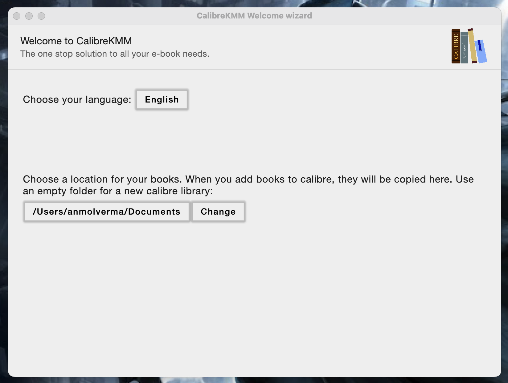

# CalibreKMM

An attempt/research clone for calibre app written in kotlin multiplatform.

* Plan to target Desktop JVM with (Jetpack Compose)

### TODOs

1. Koin does not allow to return dependencies with await() which affects providing SqlDriver on JSPlatform. 
   Figure out a way for proper DI for SQlDriver.
   see issue here: https://github.com/InsertKoinIO/koin/issues/388

### Screenshots

* Compose Desktop (Compose for Desktop)

### Languages, libraries and tools used

* [Kotlin](https://kotlinlang.org/)
* [Kotlin Coroutines](https://kotlinlang.org/docs/reference/coroutines-overview.html)
* [Kotlinx Serialization](https://github.com/Kotlin/kotlinx.serialization)
* [Ktor client library](https://github.com/ktorio/ktor)
* [Android Architecture Components](https://developer.android.com/topic/libraries/architecture/index.html)
* [Koin](https://github.com/InsertKoinIO/koin)
* [SQLDelight](https://github.com/cashapp/sqldelight)
* [Jetpack Compose](https://developer.android.com/jetpack/compose)
* [SwiftUI](https://developer.apple.com/documentation/swiftui)
* [KMP-NativeCoroutines](https://github.com/rickclephas/KMP-NativeCoroutines)